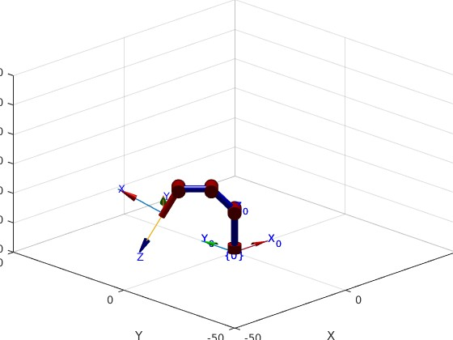
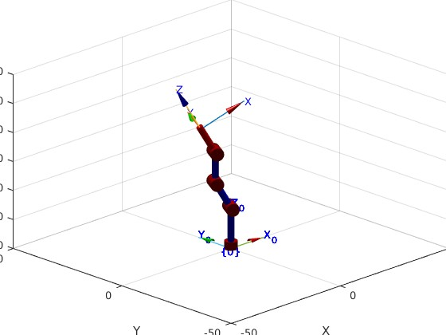
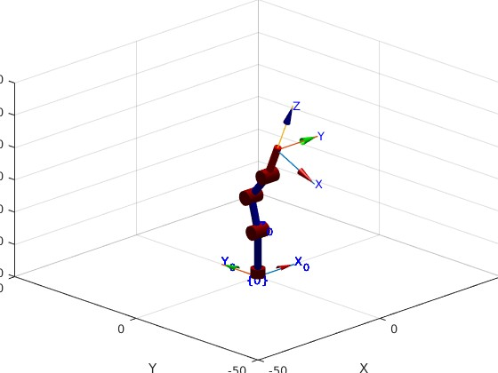

# Lab2_Robotica
### Por: Julian Luna y Javier Caicedo

## Requerimientos:
+ Ubuntu version 20.xx, preferiblemente 20.04 LTS
+ ROS Kinetic
+ MATLAB (Preferiblemente 2020a, aunque se utilizo 2022a)
+ Robotics toolbox de Mathworks
+ Toolbox Robotica de Peter Corke
+ Paquetes de Dynamixel Workbench: https://github.com/fegonzalez7/rob_unal_clase3
+ Paquete del robot Phantom X: https://github.com/felipeg17/px_robot

+ Robot Phantom X Pincher (4 grados de libertad y un actuador de herramienta)
## *A. Analisis:*

Primero obtenemos las medidas del robot con un calibrador, utilizando estos valores podemos obtener los parametros DHstd y dibujamos un diagrama del Robot Phantom X Pincher:

## *B. ROS:*
Se diseño un script en python que permite modificar los valores de las juntas, cambiando la junta deseada con las teclas W y S y enviandola a una posicion home con la tecla A y una posicion de destino con la tecla D. Este script es el llamado *ctrl_keyb_robot.py* y requiere que se haya iniciado previamente uno nodo de ROS mediante el archivo *px_controllers.launch*, que se encuentra en el paquete *px_robot* mencionado en los requerimientos e incluido tambien en este repositorio.

Podemos ejecutar el archivo *px_rviz_dyna.launch*, tambien encontrado en el paquete *px_robot*, el cual abrira una instancia de RViz donde se podra ver en tiempo real la configuracion del modelo del robot, que coincide con el con los movimientos del robot real. 

## *C. Toolbox:*
Creamos un script de matlab llamado *lab2.m*, en este, ingresamos los parametros DHstd del Phantom X y con el comando SerialLink creamos el modelo del robot:

Tambien podemos verificar la MTH de la base a la herramienta:

Y verificamos que haya quedado bien, ploteando el robot en 3 diferentes configuraciones, iniciando por Home:

## *D. Conexion con MATLAB:*
Posteriormente, tambien en *lab2.m*, podemos encontrar una seccion en la que se escribio el codigo para publicar los valores deseados a cada una de las juntas del robot de forma independiente, de forma similar a como se habia implementado en el script de python.

Tambien podemos encontrar otra seccion en la que se revisan los topicos de ROS que se encuentran en uso y el tipo de mensaje que se esta enviando al cambiar los valores de las juntas, despues de esto se crea una instancia de un suscriptor que recibe dichos mensajes e imprime el valor del angulo de cada junta en radianes, como se ve en el ejemplo para una de las posiciones descritas anteriormente:

## *E. MATLAB + ROS+ Toolbox:*
Finalmente se condensa todo lo realizado anteriormente para crear un script en la seccion final que publica una de las 5 configuraciones establecidas en el codigo a cada una de las juntas del robot y lo plotea en matlab, de forma que se pueda verificar que el robot y el modelo toman la misma posicion. Si se tiene *px_rviz_dyna.launch* corriendo, tambien se podra verificar alli que dicho modelo tambien tendra la misma configuracion:

### *q1:*

### *q2:*

### *q3:*

### *q4:*

### *q5:*

Por ultimo podemos ver el rqt_graph de los nodos involucrados en este proceso.

## *Videos:*
 Los videos demostrativos del script de Python asi como el del script de MATLAB que fueron implementados en este laboratorio se puede encontrar en los siguientes enlaces: 
 + [Video Python](https://www.youtube.com/watch?v=lk6PTTEWXIw)
 + [Video MATLAB](https://www.youtube.com/watch?v=iHmIFeksVIo)

## *Conclusiones:*
+ Siempre y cuando los parametros de DHstd hayan sido obtenidos apropiadamente, los modelos virtuales siempre deberan coincidir con la configuracion real que tomara el robot para unos mismos valores dados a las juntas.
+ Los movimientos entre una configuracion y otra pueden ser demasiado bruscos si no se modifican los limites de corriente de los motores, es por esto que es importante encontrar unos valores apropiados que permitan realizar el movimiento a una velocidad mas baja o fijar adecuadamente el robot al suelo.
+ La conexion con ROS (y por ende con el robot) sera igual sin importar si se estan enviando mensajes desde python o desde Matlab, sin embargo, python hace el proceso mucho mas sencillo.